# Il corpus della collezione, come mappa

> Nota generata. È il taglio relazionale del censimento che sta in `pokedex-home-completo/CENSIMENTO-FONTI-COLLEZIONE.md`: là c'è l'elenco, qui c'è come le fonti si tengono. Aprendo la radice del repository come vault Obsidian, i collegamenti qui sotto diventano un grafo navigabile.

La sorgente è la corsa in `_notes/fonti/reddit-pokemonhome-1vtj5hf-2026-09-08`, e il post di partenza è https://www.reddit.com/r/PokemonHome/comments/1vtj5hf/.

Il grafo disegnato qui non è quello dei rinvii fra i post, che ha oltre millecinquecento archi ed è illeggibile a occhio: è quello fra i cluster e gli host più citati, che ha una lettura sola e la dice subito, cioè quali argomenti poggino su quali sorgenti. Il grafo completo resta in `mappa.json` accanto alla corsa.

```mermaid
graph LR
  C0["Preambolo"]
  C1["1) Dex completions"]
  C2["1) Dex completions / Youtube"]
  C3["1) Dex completions / Reddit"]
  C4["1) Dex completions / Pokemon Collection Trac"]
  C5["1) Dex completions / Gen 1"]
  C6["1) Dex completions / Gen 2"]
  C7["1) Dex completions / Gen 3"]
  C8["1) Dex completions / Gen 4"]
  C9["1) Dex completions / Gen 5"]
  C10["1) Dex completions / Gen 6"]
  C11["1) Dex completions / Gen 7"]
  C12["1) Dex completions / Gen 8"]
  C13["1) Dex completions / Gen 9"]
  C14["1) Dex completions / Spinoffs"]
  C15["1) Dex completions / Overall lists for multi"]
  C16["2) What are we loosing with Pokemon Bank"]
  C17["3) Collections of one Pokemon species"]
  C18["4) Ribbon Master"]
  C19["5) Other lists and spreadsheets"]
  C20["6) How to still get Bank and other games/ 3D"]
  C21["7) General tools"]
  C22["8) Shiny Hunting"]
  C23["8) Shiny Hunting / Gen 1"]
  C24["8) Shiny Hunting / Gen 2"]
  C25["8) Shiny Hunting / Gen 3"]
  C26["8) Shiny Hunting / Gen 4"]
  C27["8) Shiny Hunting / Gen 5"]
  C28["8) Shiny Hunting / Gen 6"]
  C29["8) Shiny Hunting / Gen 7"]
  C30["8) Shiny Hunting / Gen 8"]
  C31["8) Shiny Hunting / Gen 9"]
  C32["8) Shiny Hunting / Spinoffs"]
  C33["8) Shiny Hunting / General tips"]
  C34["9) RNG Manipulation and Glitches / RNG Manip"]
  C35["9) RNG Manipulation and Glitches / Item Prin"]
  C36["9) RNG Manipulation and Glitches / Glitches"]
  C37["9) RNG Manipulation and Glitches / 8F for Ge"]
  C38["9) RNG Manipulation and Glitches / Coin Case"]
  C39["9) RNG Manipulation and Glitches / ACE codin"]
  C40["10) Lastly, a shootout the YT channels I fol"]
  C41["Commenti al post"]
  H0(("bluemoonfalls.com"))
  H1(("bulbapedia.bulbagarden.net"))
  H2(("buriedrelic.neocities.org"))
  H3(("pokejungle.net"))
  H4(("projectpokemon.org"))
  H5(("reddit.com"))
  H6(("rotomlabs.net"))
  H7(("serebii.net"))
  H8(("smogon.com"))
  H9(("x.com"))
  H10(("youtu.be"))
  H11(("youtube.com"))
  C15 -->|6| H5
  C16 -->|6| H5
  C40 -->|6| H11
  C6 -->|5| H5
  C2 -->|4| H11
  C7 -->|4| H5
  C8 -->|4| H5
  C9 -->|4| H1
  C17 -->|4| H7
  C28 -->|4| H11
  C32 -->|4| H5
  C4 -->|3| H5
  C5 -->|3| H5
  C11 -->|3| H1
  C11 -->|3| H11
  C20 -->|3| H5
  C31 -->|3| H5
  C34 -->|3| H11
  C1 -->|2| H5
  C7 -->|2| H11
  C8 -->|2| H11
  C13 -->|2| H7
  C18 -->|2| H5
  C19 -->|2| H1
  C32 -->|2| H2
  C32 -->|2| H11
  C35 -->|2| H5
  C39 -->|2| H5
  C41 -->|2| H5
  C0 -->|1| H5
  C1 -->|1| H3
  C1 -->|1| H11
  C2 -->|1| H10
  C3 -->|1| H5
  C7 -->|1| H1
  C8 -->|1| H1
  C9 -->|1| H11
  C10 -->|1| H5
  C10 -->|1| H11
  C12 -->|1| H7
  C12 -->|1| H5
  C13 -->|1| H11
  C14 -->|1| H1
  C14 -->|1| H5
  C14 -->|1| H9
  C14 -->|1| H7
  C15 -->|1| H1
  C15 -->|1| H7
  C17 -->|1| H4
  C17 -->|1| H9
  C19 -->|1| H5
  C19 -->|1| H4
  C19 -->|1| H11
  C21 -->|1| H6
  C22 -->|1| H5
  C23 -->|1| H0
  C24 -->|1| H2
  C24 -->|1| H5
  C24 -->|1| H1
  C24 -->|1| H0
  C25 -->|1| H2
  C25 -->|1| H5
  C26 -->|1| H2
  C26 -->|1| H1
  C26 -->|1| H10
  C26 -->|1| H5
  C27 -->|1| H2
  C27 -->|1| H1
  C28 -->|1| H5
  C29 -->|1| H11
  C29 -->|1| H5
  C29 -->|1| H8
  C30 -->|1| H5
  C30 -->|1| H11
  C32 -->|1| H6
  C33 -->|1| H5
  C33 -->|1| H2
  C33 -->|1| H1
  C34 -->|1| H5
  C34 -->|1| H8
  C35 -->|1| H11
  C36 -->|1| H11
  C37 -->|1| H5
  C39 -->|1| H11
  C41 -->|1| H11
  C41 -->|1| H7
```

## I cluster

| Cluster | Fonti | Nota |
|---|---|---|
| Preambolo | 1 | [[Preambolo]] |
| 1) Dex completions | 4 | [[1- Dex completions]] |
| 1) Dex completions / Youtube | 5 | [[1- Dex completions - Youtube]] |
| 1) Dex completions / Reddit | 1 | [[1- Dex completions - Reddit]] |
| 1) Dex completions / Pokemon Collection Trackers | 7 | [[1- Dex completions - Pokemon Collection Trackers]] |
| 1) Dex completions / Gen 1 | 3 | [[1- Dex completions - Gen 1]] |
| 1) Dex completions / Gen 2 | 5 | [[1- Dex completions - Gen 2]] |
| 1) Dex completions / Gen 3 | 8 | [[1- Dex completions - Gen 3]] |
| 1) Dex completions / Gen 4 | 7 | [[1- Dex completions - Gen 4]] |
| 1) Dex completions / Gen 5 | 5 | [[1- Dex completions - Gen 5]] |
| 1) Dex completions / Gen 6 | 2 | [[1- Dex completions - Gen 6]] |
| 1) Dex completions / Gen 7 | 6 | [[1- Dex completions - Gen 7]] |
| 1) Dex completions / Gen 8 | 2 | [[1- Dex completions - Gen 8]] |
| 1) Dex completions / Gen 9 | 5 | [[1- Dex completions - Gen 9]] |
| 1) Dex completions / Spinoffs | 4 | [[1- Dex completions - Spinoffs]] |
| 1) Dex completions / Overall lists for multiple generations | 10 | [[1- Dex completions - Overall lists for multiple generations]] |
| 2) What are we loosing with Pokemon Bank | 6 | [[2- What are we loosing with Pokemon Bank]] |
| 3) Collections of one Pokemon species | 6 | [[3- Collections of one Pokemon species]] |
| 4) Ribbon Master | 3 | [[4- Ribbon Master]] |
| 5) Other lists and spreadsheets | 6 | [[5- Other lists and spreadsheets]] |
| 6) How to still get Bank and other games/ 3DS modding | 4 | [[6- How to still get Bank and other games- 3DS modding]] |
| 7) General tools | 3 | [[7- General tools]] |
| 8) Shiny Hunting | 1 | [[8- Shiny Hunting]] |
| 8) Shiny Hunting / Gen 1 | 1 | [[8- Shiny Hunting - Gen 1]] |
| 8) Shiny Hunting / Gen 2 | 4 | [[8- Shiny Hunting - Gen 2]] |
| 8) Shiny Hunting / Gen 3 | 2 | [[8- Shiny Hunting - Gen 3]] |
| 8) Shiny Hunting / Gen 4 | 4 | [[8- Shiny Hunting - Gen 4]] |
| 8) Shiny Hunting / Gen 5 | 3 | [[8- Shiny Hunting - Gen 5]] |
| 8) Shiny Hunting / Gen 6 | 5 | [[8- Shiny Hunting - Gen 6]] |
| 8) Shiny Hunting / Gen 7 | 3 | [[8- Shiny Hunting - Gen 7]] |
| 8) Shiny Hunting / Gen 8 | 2 | [[8- Shiny Hunting - Gen 8]] |
| 8) Shiny Hunting / Gen 9 | 3 | [[8- Shiny Hunting - Gen 9]] |
| 8) Shiny Hunting / Spinoffs | 9 | [[8- Shiny Hunting - Spinoffs]] |
| 8) Shiny Hunting / General tips | 3 | [[8- Shiny Hunting - General tips]] |
| 9) RNG Manipulation and Glitches / RNG Manipulation - the best sources to start | 7 | [[9- RNG Manipulation and Glitches - RNG Manipulation - the best sources to start]] |
| 9) RNG Manipulation and Glitches / Item Printer Gen 9 | 3 | [[9- RNG Manipulation and Glitches - Item Printer Gen 9]] |
| 9) RNG Manipulation and Glitches / Glitches | 1 | [[9- RNG Manipulation and Glitches - Glitches]] |
| 9) RNG Manipulation and Glitches / 8F for Gen 1 games | 1 | [[9- RNG Manipulation and Glitches - 8F for Gen 1 games]] |
| 9) RNG Manipulation and Glitches / Coin Case Glitch for Gen 2 games | 1 | [[9- RNG Manipulation and Glitches - Coin Case Glitch for Gen 2 games]] |
| 9) RNG Manipulation and Glitches / ACE coding in Gen 2 & Gen 3 | 4 | [[9- RNG Manipulation and Glitches - ACE coding in Gen 2 - Gen 3]] |
| 10) Lastly, a shootout the YT channels I follow closely on the topic of collecting | 6 | [[10- Lastly- a shootout the YT channels I follow closely on the topic of collecti]] |
| Commenti al post | 5 | [[Commenti al post]] |

## Gli host, e che cosa ciascuno porta

| Host | Fonti | Cluster in cui compare |
|---|---|---|
| reddit.com | 67 | 31 |
| youtube.com | 37 | 19 |
| bulbapedia.bulbagarden.net | 17 | 11 |
| serebii.net | 10 | 6 |
| buriedrelic.neocities.org | 7 | 6 |
| youtu.be | 2 | 2 |
| x.com | 2 | 2 |
| projectpokemon.org | 2 | 2 |
| rotomlabs.net | 2 | 2 |
| bluemoonfalls.com | 2 | 2 |
| smogon.com | 2 | 2 |
| pokejungle.net | 1 | 1 |
| classic.pokepc.net | 1 | 1 |
| pokedextracker.com | 1 | 1 |
| austinjohnplays.com | 1 | 1 |
| godex.site | 1 | 1 |
| gist.github.com | 1 | 1 |
| cecilbowen.github.io | 1 | 1 |
| imgur.com | 1 | 1 |
| shacknews.com | 1 | 1 |
| pkmnclassic.net | 1 | 1 |
| ribbons.guide | 1 | 1 |
| m.bulbapedia.bulbagarden.net | 1 | 1 |
| 3ds.hacks.guide | 1 | 1 |
| dragonflycave.com | 1 | 1 |
| blisy.net | 1 | 1 |
| pokebip.com | 1 | 1 |
| pokemonrng.com | 1 | 1 |
| retailrng.com | 1 | 1 |
| glitchcity.wiki | 1 | 1 |
| e-sh4rk.github.io | 1 | 1 |
| docs.google.com | 1 | 1 |
