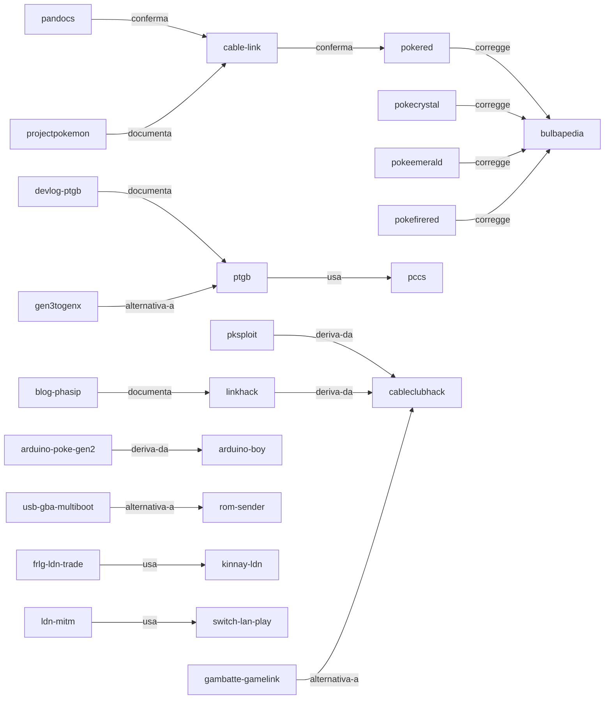

# Mappa delle fonti

Questa cartella contiene una nota per ciascuna fonte che porta peso tecnico, con il suo abstract, il motivo per cui e' in archivio, il punto esatto del progetto che serve e le relazioni verso le altre fonti. Il registro completo, comprese le voci minori e quelle non lette, resta [[SOURCES]]: questa mappa non lo sostituisce, lo rende navigabile.

Le note sono generate da `tools/build-source-map.py` a partire da una tabella unica, per la stessa ragione per cui le tabelle caratteri sono generate: i dati stanno in un posto solo e la forma resta uniforme. Modificare una nota a mano significa perderla alla rigenerazione successiva; si modifica la tabella.

Aprendo la radice del repository come vault Obsidian, le relazioni dichiarate nel frontmatter e i collegamenti nel corpo diventano il grafo. Il diagramma qui sotto ne mostra la struttura portante per chi legge il file senza Obsidian.

## Le fonti, per livello

### Livello 1

| Fonte | Track | Serve a |
|---|---|---|
| [[pokered]] | BRI | [[DATA-FORMATS_Gen1-Gen2-Gen3]], [[08-cavo-link]], [[09-esecuzione-codice]] |
| [[pokecrystal]] | BRI | [[DATA-FORMATS_Gen1-Gen2-Gen3]], [[06-identita-pokemon]], [[08-cavo-link]] |
| [[pokeemerald]] | BRI, SME | [[DATA-FORMATS_Gen1-Gen2-Gen3]], [[04-cifratura-gen3]], [[03-integrita-checksum]], [[22-strumenti]] |
| [[pokefirered]] | BRI, LDN, SME | [[22-strumenti]], [[DATA-FORMATS_Gen1-Gen2-Gen3]] |
| [[pokeruby]] | BRI, SME | [[22-strumenti]] |
| [[pandocs]] | BRI | [[08-cavo-link]], [[30-opzioni-implementative]] |
| [[gbatek]] | BRI | [[10-multiboot-hardware]] |
| [[copetti]] | BRI | [[10-multiboot-hardware]] |
| [[kinnay-ldn]] | LDN | [[04-cifratura-gen3]] |

### Livello 2

| Fonte | Track | Serve a |
|---|---|---|
| [[bulbapedia]] | BRI, SME, LDN | [[DATA-FORMATS_Gen1-Gen2-Gen3]], [[23-prove-eseguite]] |
| [[glitchcity]] | BRI | [[09-esecuzione-codice]] |

### Livello 3

| Fonte | Track | Serve a |
|---|---|---|
| [[ptgb]] | BRI | [[09-esecuzione-codice]], [[30-opzioni-implementative]] |
| [[pccs]] | BRI | [[07-conversione-vincoli]], [[DATA-FORMATS_Gen1-Gen2-Gen3]] |
| [[gen3togenx]] | BRI | [[08-cavo-link]], [[30-opzioni-implementative]] |
| [[pokemongb-online]] | BRI | [[21-collaudo]] |
| [[cable-link]] | BRI | [[08-cavo-link]], [[30-opzioni-implementative]] |
| [[pksploit]] | BRI, SME | [[09-esecuzione-codice]], [[30-opzioni-implementative]] |
| [[cableclubhack]] | BRI | [[09-esecuzione-codice]], [[21-collaudo]] |
| [[linkhack]] | BRI | [[09-esecuzione-codice]] |
| [[arduino-poke-gen2]] | BRI | [[30-opzioni-implementative]] |
| [[arduino-boy]] | BRI | [[30-opzioni-implementative]] |
| [[gba-link-connection]] | BRI | [[10-multiboot-hardware]], [[30-opzioni-implementative]] |
| [[reon]] | BRI | [[08-cavo-link]] |
| [[gen3distributions]] | BRI | [[10-multiboot-hardware]] |
| [[stadium-ace]] | BRI | [[08-cavo-link]] |
| [[usb-gba-multiboot]] | BRI | [[10-multiboot-hardware]] |
| [[rom-sender]] | BRI | [[10-multiboot-hardware]] |
| [[frlg-ldn-trade]] | LDN | [[06-identita-pokemon]] |
| [[ldn-mitm]] | LDN | [[06-identita-pokemon]] |
| [[switch-lan-play]] | LDN | [[06-identita-pokemon]] |
| [[pokemon-automation]] | AUT | [[30-opzioni-implementative]] |

### Livello 4

| Fonte | Track | Serve a |
|---|---|---|
| [[devlog-ptgb]] | BRI | [[09-esecuzione-codice]], [[10-multiboot-hardware]], [[08-cavo-link]] |
| [[blog-phasip]] | BRI | [[09-esecuzione-codice]] |

### Livello 5

| Fonte | Track | Serve a |
|---|---|---|
| [[gambatte-gamelink]] | BRI | [[21-collaudo]] |
| [[projectpokemon]] | SME, BRI | [[22-strumenti]] |
