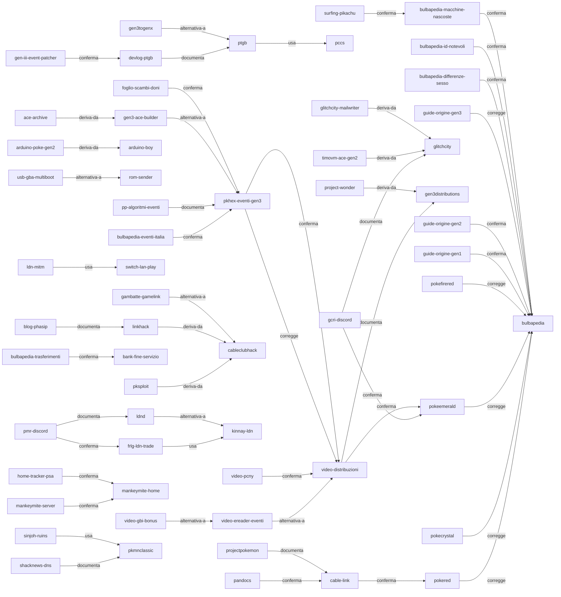

# Mappa delle fonti

Questa cartella contiene una nota per ciascuna fonte che porta peso tecnico, con il suo abstract, il motivo per cui è in archivio, il punto esatto del progetto che serve e le relazioni verso le altre fonti. Il registro completo, comprese le voci minori e quelle non lette, resta [[SOURCES]]: questa mappa non lo sostituisce, lo rende navigabile.

Le note sono generate da `tools/build-source-map.py` a partire da una tabella unica, per la stessa ragione per cui le tabelle caratteri sono generate: i dati stanno in un posto solo e la forma resta uniforme. Modificare una nota a mano significa perderla alla rigenerazione successiva; si modifica la tabella.

Aprendo la radice del repository come vault Obsidian, le relazioni dichiarate nel frontmatter e i collegamenti nel corpo diventano il grafo. Il diagramma qui sotto ne mostra la struttura portante per chi legge il file senza Obsidian.

## Le fonti, per livello

### Livello 1

| Fonte | Track | Serve a |
|---|---|---|
| [[pokered]] | BRI | [[DATA-FORMATS_Gen1-Gen2-Gen3]], [[08-cavo-link]], [[09-esecuzione-codice]] |
| [[pokecrystal]] | BRI | [[DATA-FORMATS_Gen1-Gen2-Gen3]], [[06-identita-pokemon]], [[08-cavo-link]] |
| [[pokeemerald]] | BRI, SME | [[DATA-FORMATS_Gen1-Gen2-Gen3]], [[04-cifratura-gen3]], [[03-integrita-checksum]], [[22-strumenti]] |
| [[pokefirered]] | BRI, LDN, SME | [[22-strumenti]], [[DATA-FORMATS_Gen1-Gen2-Gen3]] |
| [[pokeruby]] | BRI, SME | [[22-strumenti]] |
| [[pandocs]] | BRI | [[08-cavo-link]], [[30-opzioni-implementative]] |
| [[gbatek]] | BRI | [[10-multiboot-hardware]] |
| [[copetti]] | BRI | [[10-multiboot-hardware]] |
| [[kinnay-ldn]] | LDN | [[04-cifratura-gen3]] |
| [[ldnd]] | LDN | [[11-wireless-locale-e-ponte-switch]] |
| [[pokeyellow]] | BRI | [[12-analisi-quantitativa]] |
| [[pokegold]] | BRI | [[DATA-FORMATS_Gen1-Gen2-Gen3]] |
| [[frlg-home]] | ACE, EVT, LDN, 3DS | [[CATENA-DI-TRASFERIMENTO]], [[STUDIO-09-la-regola-del-tracciatore-e-le-porte-dopo-la-chiusura]] |
| [[tpc-dati-alterati]] | ACE, GEN, EVT | [[20-architettura-codice]] |

### Livello 2

| Fonte | Track | Serve a |
|---|---|---|
| [[bulbapedia]] | BRI, SME, LDN | [[DATA-FORMATS_Gen1-Gen2-Gen3]], [[23-prove-eseguite]] |
| [[glitchcity]] | BRI | [[09-esecuzione-codice]] |
| [[bank-fine-servizio]] | EVT, 3DS | [[11-wireless-locale-e-ponte-switch]] |
| [[bulbapedia-trasferimenti]] | EVT, 3DS | [[11-wireless-locale-e-ponte-switch]] |
| [[bulbapedia-eventi-italia]] | EVT | [[23-prove-eseguite]] |
| [[bulbapedia-differenze-sesso]] | PKD | [[DIFFERENZE-DI-SESSO]], [[CONFRONTO-FOGLIO-LIVINGDEX]] |
| [[bulbapedia-id-notevoli]] | PKD, EVT | [[ID-NOTEVOLI]] |
| [[timovm-ace-gen2]] | ACE, PKD, EVT | [[STUDIO-08-esecuzione-di-codice-e-manipolazione-del-generatore]], [[09-esecuzione-codice]] |
| [[glitchcity-mailwriter]] | ACE, PKD | [[STUDIO-08-esecuzione-di-codice-e-manipolazione-del-generatore]] |
| [[bulbapedia-macchine-nascoste]] | PKD, EVT | [[MOSSE-MN]], [[CATENA-DI-TRASFERIMENTO]] |
| [[surfing-pikachu]] | EVT, PKD | [[CATENA-DI-TRASFERIMENTO]] |

### Livello 3

| Fonte | Track | Serve a |
|---|---|---|
| [[ptgb]] | BRI | [[09-esecuzione-codice]], [[30-opzioni-implementative]] |
| [[pccs]] | BRI | [[07-conversione-vincoli]], [[DATA-FORMATS_Gen1-Gen2-Gen3]] |
| [[gen3togenx]] | BRI | [[08-cavo-link]], [[30-opzioni-implementative]] |
| [[pokemongb-online]] | BRI | [[21-collaudo]] |
| [[cable-link]] | BRI | [[08-cavo-link]], [[30-opzioni-implementative]] |
| [[pksploit]] | BRI, SME | [[09-esecuzione-codice]], [[30-opzioni-implementative]] |
| [[cableclubhack]] | BRI | [[09-esecuzione-codice]], [[21-collaudo]] |
| [[linkhack]] | BRI | [[09-esecuzione-codice]] |
| [[arduino-poke-gen2]] | BRI | [[30-opzioni-implementative]] |
| [[arduino-boy]] | BRI | [[30-opzioni-implementative]] |
| [[gba-link-connection]] | BRI | [[10-multiboot-hardware]], [[30-opzioni-implementative]] |
| [[reon]] | BRI | [[08-cavo-link]] |
| [[gen3distributions]] | BRI | [[10-multiboot-hardware]] |
| [[stadium-ace]] | BRI | [[08-cavo-link]] |
| [[usb-gba-multiboot]] | BRI | [[10-multiboot-hardware]] |
| [[rom-sender]] | BRI | [[10-multiboot-hardware]] |
| [[frlg-ldn-trade]] | LDN | [[06-identita-pokemon]], [[11-wireless-locale-e-ponte-switch]] |
| [[ldn-mitm]] | LDN | [[06-identita-pokemon]] |
| [[switch-lan-play]] | LDN | [[06-identita-pokemon]] |
| [[pokemon-automation]] | AUT, LDN | [[30-opzioni-implementative]] |
| [[pokerom-trader]] | BRI | [[30-opzioni-implementative]] |
| [[pkhex-eventi-gen3]] | EVT, BRI, SME | [[06-identita-pokemon]], [[12-analisi-quantitativa]], [[23-prove-eseguite]] |
| [[gen-iii-event-patcher]] | EVT, BRI | [[09-esecuzione-codice]], [[10-multiboot-hardware]] |
| [[project-wonder]] | EVT | [[10-multiboot-hardware]], [[11-wireless-locale-e-ponte-switch]] |
| [[eventsgallery]] | EVT | [[24-fonti-di-community]] |
| [[gen3-ace-builder]] | ACE, EVT | [[23-prove-eseguite]] |
| [[ace-archive]] | ACE | [[09-esecuzione-codice]] |
| [[home-checklist]] | ACE, GEN, EVT | [[CHECKLIST-COMPLETA]] |
| [[pkmnclassic]] | EVT, PKD | [[STUDIO-04-la-via-del-dns-e-il-servizio-rianimato]] |

### Livello 4

| Fonte | Track | Serve a |
|---|---|---|
| [[devlog-ptgb]] | BRI | [[09-esecuzione-codice]], [[10-multiboot-hardware]], [[08-cavo-link]] |
| [[blog-phasip]] | BRI | [[09-esecuzione-codice]] |
| [[pmr-discord]] | LDN, BRI | [[11-wireless-locale-e-ponte-switch]], [[30-opzioni-implementative]] |
| [[gcri-discord]] | BRI | [[09-esecuzione-codice]], [[05-testo-e-charmap]] |
| [[gbatemp-vc-save]] | 3DS | [[01-fondamenta-salvataggio]] |
| [[video-goppier]] | BRI | [[08-cavo-link]], [[30-opzioni-implementative]] |
| [[video-trascritti]] | BRI, SME, 3DS, LDN | [[21-collaudo]], [[24-fonti-di-community]] |
| [[retroreversing]] | BRI | [[08-cavo-link]] |
| [[hackaday-ponte]] | BRI | [[30-opzioni-implementative]] |
| [[video-distribuzioni]] | EVT, BRI | [[03-integrita-checksum]], [[10-multiboot-hardware]], [[06-identita-pokemon]] |
| [[video-ereader-eventi]] | EVT, SME | [[01-fondamenta-salvataggio]], [[22-strumenti]] |
| [[video-pcny]] | EVT | [[24-fonti-di-community]] |
| [[video-gbi-bonus]] | EVT | [[12-analisi-quantitativa]], [[10-multiboot-hardware]] |
| [[mankeymite-home]] | ACE, EVT, 3DS, LDN | [[CATENA-DI-TRASFERIMENTO]], [[STUDIO-09-la-regola-del-tracciatore-e-le-porte-dopo-la-chiusura]] |
| [[amiibodoctor-generazione]] | GEN | [[24-fonti-di-community]] |
| [[shacknews-dns]] | EVT, PKD | [[STUDIO-04-la-via-del-dns-e-il-servizio-rianimato]] |

### Livello 5

| Fonte | Track | Serve a |
|---|---|---|
| [[gambatte-gamelink]] | BRI | [[21-collaudo]] |
| [[projectpokemon]] | SME, BRI | [[22-strumenti]] |
| [[gbatemp-smeraldo]] | SME | [[01-fondamenta-salvataggio]], [[22-strumenti]] |
| [[pp-algoritmi-eventi]] | EVT | [[24-fonti-di-community]] |
| [[mankeymite-server]] | ACE, EVT, GEN, LDN | [[24-fonti-di-community]] |
| [[insidegadgets-canale]] | BAT, SME, BRI | [[RUNBOOK-PRIMA-SESSIONE]] |
| [[berichandev]] | GEN | [[24-fonti-di-community]] |
| [[home-tracker-psa]] | PKD, EVT, ACE | [[CATENA-DI-TRASFERIMENTO]], [[STUDIO-09-la-regola-del-tracciatore-e-le-porte-dopo-la-chiusura]] |
| [[guide-origine-gen1]] | PKD, EVT | [[LETTURA-DEL-CORPUS]], [[CENSIMENTO-SCAMBI]] |
| [[guide-origine-gen2]] | PKD, EVT | [[LETTURA-DEL-CORPUS]], [[CHECKLIST-COMPLETA]] |
| [[guide-origine-gen3]] | PKD, EVT | [[LETTURA-DEL-CORPUS]], [[OTTENIBILITA-TITOLI]] |
| [[sfide-impossibili]] | PKD | [[STUDIO-06-le-enumerazioni-trasversali]] |
| [[bank-exclusives]] | PKD, EVT | [[STUDIO-05-gli-assi-che-non-contavamo]], [[MOSSE-PERDUTE]] |
| [[foglio-scambi-doni]] | PKD, EVT | [[STUDIO-06-le-enumerazioni-trasversali]], [[CENSIMENTO-SCAMBI]] |
| [[foglio-eventi-interni]] | PKD | [[STUDIO-06-le-enumerazioni-trasversali]], [[INDICE-FOGLI-ESTERNI]] |
| [[sottolivellati]] | PKD | [[STUDIO-06-le-enumerazioni-trasversali]] |
| [[sinjoh-ruins]] | PKD, EVT | [[LETTURA-DEL-CORPUS]], [[STUDIO-04-la-via-del-dns-e-il-servizio-rianimato]] |
